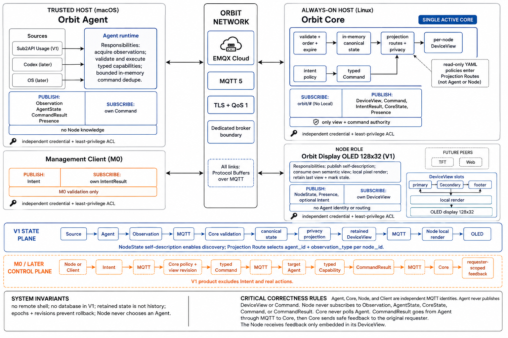

# Orbit

Orbit connects trusted host state to small display nodes. The current V1
working path reads Sub2API usage in a host Agent, transports Protobuf
observations over MQTT, projects them in Core, and publishes a retained
three-slot view for an OLED node:

~~~text
Sub2API -> orbit-agent -> MQTT -> orbit-core -> retained DeviceView -> OLED node
~~~

Sub2API credentials stay on the Agent. The node receives only formatted cost,
token, TPM, and freshness text. The repository currently implements the
Sub2API-to-OLED status path; command capabilities and other sources are not
part of the runnable V1 path yet.

## Requirements

- Go 1.27 or newer (go.mod declares go 1.27.0).
- uv and Python 3.13 or newer for the firmware project.
- A C++17 toolchain supported by PlatformIO.
- For live operation: an MQTT broker reachable by all participants, credentials
  and ACLs for the Agent, Core, and node; a reachable Sub2API account when that
  source is enabled; and a local Codex home when Codex is enabled.
- For hardware operation: a YD-ESP32-S3, an SSD1306 128x32 I2C OLED, and a
  USB data connection.

Check the local tools before installing dependencies:

~~~shell
go version
uv --version
python3 --version
~~~

The root Makefile installs pinned Buf and protoc-gen-go binaries under the
ignored .tools/bin/ directory when protocol targets first need them. The
OLED project keeps its pinned Python and PlatformIO dependencies in
nodes/display/models/oled-128x32/variants/yd-esp32-s3/uv.lock.

## Install

From the repository root, download Go dependencies and run the Go build:

~~~shell
go mod download
make build-go
~~~

Install the firmware environment separately:

~~~shell
cd nodes/display/models/oled-128x32/variants/yd-esp32-s3
uv sync
~~~

uv sync creates the ignored .venv/. PlatformIO may download its board and
library packages on the first firmware build, so the build host needs network
access.

## Configure

There are three independent YAML contracts. Copy the examples to the ignored
local paths before starting anything:

~~~shell
cp configs/agent.example.yaml configs/agent.local.yaml
cp configs/core.example.yaml configs/core.local.yaml
cp nodes/display/models/oled-128x32/variants/yd-esp32-s3/config.example.yaml \
  nodes/display/models/oled-128x32/variants/yd-esp32-s3/config.local.yaml
~~~

### Agent and Core

The host examples resolve relative secret paths from the directory containing
the YAML file. Create the referenced files under configs/secrets/ (one value
per file; do not commit them):

~~~text
configs/secrets/mqtt-ca.pem
configs/secrets/agent-client.pem
configs/secrets/agent-client.key
configs/secrets/agent-mqtt-username
configs/secrets/agent-mqtt-password
configs/secrets/core-client.pem
configs/secrets/core-client.key
configs/secrets/core-mqtt-username
configs/secrets/core-mqtt-password
configs/secrets/sub2api-email
configs/secrets/sub2api-password
~~~

Update the local YAML values for the selected broker and account:

- agent.local.yaml: agent.id and agent.host_label, MQTT URL/TLS files, and the
  settings for each enabled source. Sub2API uses HTTPS endpoints and secret
  files; Codex uses codex_home (or the local CODEX_HOME/default) and its
  polling, filtering, and privacy settings.
- core.local.yaml: core.id, MQTT URL/TLS files, and projection_routes.

The Core route key must equal the node configuration's node.id; its
inputs[0].agent_id must equal the Agent's resolved ID (agent.id when it is
explicitly set). These three values must describe the same deployment. The
example route therefore connects desk-oled-01 to agent-local.

Host configuration is strict and is validated before a process connects. IDs
must match [a-z0-9][a-z0-9_-]{0,63}. Agent host_label, Core routes, the usage
policy, MQTT credentials, and all enabled source values are required. Durations
use Go syntax such as 30s, 10s, and 2m; Sub2API requires USD and each source's
observation TTL must be at least its poll interval.

The Codex source reads local projection databases in read-only mode. Display
names and project names are omitted unless their privacy flags are explicitly
enabled. `include_display_name` is a deliberate opt-in because the value may
come from a Codex title or first-user-message fallback.

TLS is enabled by default. With TLS enabled, use an mqtts:// URL and provide
the CA file; client certificate and key must be supplied together if the broker
requires them. To intentionally use a plaintext broker, set
mqtt.tls.enabled: false, change the URL to mqtt://, and leave all TLS file
fields empty. The clients never downgrade automatically after a TLS failure.

Keep host YAML and secret files local. They are ignored by Git, but a file
being ignored does not make its contents safe to share in logs or commits.

### OLED node

Edit config.local.yaml with the physical node ID, firmware version, Wi-Fi
credentials, MQTT host/port/credentials, the broker CA, and optional display
brightness. The node schema is in config.schema.yaml.

Node Wi-Fi and MQTT values are embedded into the firmware at build time. The
node config file must therefore remain private and must not be committed. The
default TLS CA points at the checked-in example asset
assets/DigiCertGlobalRootG2.crt; replace it with the root certificate for the
actual broker. A TLS-enabled build fails if its CA file cannot be read.

The hardware wiring expected by this variant is:

| Signal | Connection |
| --- | --- |
| Board | YD-ESP32-S3 (esp32-s3-devkitc-1) |
| OLED | SSD1306, 128x32, 3.3 V, I2C address 0x3C |
| SDA | GPIO5 |
| SCL | GPIO6 |

## Automated checks

Run these from the repository root. A passing check exits with status 0; any
non-zero status is a failure even if some earlier packages passed.

~~~shell
make test-go       # Go unit tests and in-memory source/integration tests
go test ./internal/agent ./internal/integration
go test -race ./internal/agent ./internal/integration
go test ./internal/sources/codex
env ORBIT_CODEX_LIVE_TEST=1 go test ./internal/sources/codex -run '^TestLiveSmoke$' -count=1
make test-node     # YAML tests and PlatformIO native firmware tests
make proto-lint    # Buf schema lint; installs the pinned Buf if needed
make generate      # regenerate Go bindings under gen/go/
make build-go      # compile all Go packages
make build-node    # generate nanopb and compile the YD-ESP32-S3 firmware
make verify        # fmt-check, lint, all tests, protocol checks, and builds
~~~

make test-go uses an in-memory MQTT broker, an httptest Sub2API server, and
Codex fixtures. It proves source selection, initial AgentState ordering,
independent revisions/health, and privacy bounds, but does not use the local
YAML, a real broker, real Sub2API credentials, local Codex files, or hardware.

The `TestLiveSmoke` command is a read-only local Codex adapter check. It passes
only when the current user's Codex projections contain at least one session;
it does not publish MQTT or expose session contents in the test output.

make verify is accepted only when the command exits with status 0 after every
stage (format check, Go vet/tests, Buf lint, node tests, and both builds). A
passing automated run still does not validate a real Broker, TLS certificate
chain, ACL, Sub2API account, Wi-Fi connection, or physical OLED.

make test-node runs the Python config-codegen tests and the native PlatformIO
tests for view freshness, revision ordering, dirty-region calculation, and
Protobuf codec behavior. The native target generates nanopb bindings into the
ignored src/generated-proto/ directory.

make build-node deliberately builds with config.example.yaml, so it checks
firmware compilation and code generation without embedding local credentials.
It does not prove Wi-Fi, broker TLS/ACL, Sub2API, or OLED behavior.

Generated Go code is owned by Buf and must not be edited manually. If protocol
sources change, run make generate and then rerun make proto-lint and the
relevant tests.

## Run the host services

The live host path needs a reachable broker and the configured secret files.
Start Core first so it is subscribed before observations arrive. Use separate
terminals when inspecting logs:

~~~shell
make dev-core CORE_CONFIG=configs/core.local.yaml
make dev-agent AGENT_CONFIG=configs/agent.local.yaml
~~~

make dev is the equivalent parallel launch:

~~~shell
make dev AGENT_CONFIG=configs/agent.local.yaml \
  CORE_CONFIG=configs/core.local.yaml
~~~

Each service exits non-zero on a configuration, TLS, authentication, ACL, or
initial MQTT connection error. A successful startup emits an "orbit core
started" or "orbit agent started" log message after the MQTT connection is
established. With logging.level: debug, the live acceptance log sequence also
includes "usage observation published" from Agent, "usage observation
accepted" and "device view published" from Core, and "node state accepted"
after the node connects.

After startup, each enabled source is polled immediately and then at its own
configured interval. A successful live chain has these messages in the broker:

| Topic | Publisher | Consumer | Retained |
| --- | --- | --- | --- |
| orbit/v1/agents/{agent_id}/state | Agent | Core | yes |
| orbit/v1/agents/{agent_id}/observations/usage | Agent | Core | no |
| orbit/v1/nodes/{node_id}/state | Node | Core | yes |
| orbit/v1/nodes/{node_id}/view | Core | Node | yes |

All Go MQTT payloads use application/protobuf and QoS 1. Broker ACLs should
allow each identity only the publish/subscribe rows it owns. See
[docs/mqtt-topics.md](docs/mqtt-topics.md) and
[docs/security.md](docs/security.md) for the contract and deployment
security requirements.

### Codex-only live acceptance

1. Copy `configs/agent.example.yaml` to a local file, enable
   `sources.codex`, set `sources.codex.codex_home` when the projections are not
   under the default `~/.codex`, and disable `sources.sub2api`.
2. Start the Agent with a reachable broker:

~~~shell
make dev-agent AGENT_CONFIG=configs/agent.codex.local.yaml
~~~

3. Subscribe with a credential authorized for the Agent topic subtree and
   confirm the first message is retained AgentState with Codex health
   `UNSPECIFIED`, followed by a non-retained Codex observation and a retained
   healthy AgentState. Decode the Protobuf and verify metadata revision `1`,
   the configured `agent_epoch`, and an `expires_at` after `produced_at`.
4. With the default privacy settings, `display_name` and `project_name` must be
   empty, so no title or first-user-message fallback appears. There is no
   separate raw prompt/title field. If `include_display_name` is enabled, its
   value may carry the Codex title or first-user-message fallback and must be
   treated as sensitive opt-in data. Source JSON, full paths, rollout paths,
   and PIDs never appear in the payload or logs. Logs contain source type,
   aggregate counts, revision, bytes, and stable error codes only.

The in-memory integration test is the deterministic Agent-side version of this
sequence; the broker command additionally proves deployment TLS, credentials,
ACLs, and MQTT delivery.

## Build, flash, and inspect the OLED node

Run the following from the node variant directory after uv sync:

~~~shell
cd nodes/display/models/oled-128x32/variants/yd-esp32-s3
make check
make build CONFIG=config.local.yaml
~~~

make build regenerates nanopb bindings and the generated configuration header
before compiling. A non-zero result means either the YAML/CA file, Protobuf
generation, or firmware compilation failed. To find the serial port, use the
PlatformIO CLI and then pass it to the upload and monitor targets:

~~~shell
uv run pio device list
make upload CONFIG=config.local.yaml PORT=/dev/cu.usbmodemXXXX
make monitor PORT=/dev/cu.usbmodemXXXX BAUD=115200
~~~

Use the device path reported on the current host (/dev/ttyACM0 is common on
Linux). The monitor uses 115200 baud with DTR/RTS disabled.

On reset, the serial output should include Orbit display boot, an I2C scan
finding 0x3C, and OLED ready. The display state labels are observable
acceptance signals:

- WIFI, TIME, and MQTT identify the current connection prerequisite.
- MQTT ERR, PROTO ERR, SIZE ERR, and VIEW ERR identify a runtime error.
- A valid retained view shows the primary, secondary, and footer slots; the
  small marker in the top-right indicates stale data.

The full live acceptance is: the node reaches OLED ready, connects to Wi-Fi
and the broker, publishes retained NodeState, receives its retained
orbit/v1/nodes/{node_id}/view, and renders the three slots without an error
label. The primary slot is formatted cost, the secondary slot is token count,
and the footer is TPM; the integration fixture renders $12.35, 1M, and 4K,
while live values depend on Sub2API. The node does not print a dedicated
MQTT-success line, so confirm the
NodeState/View topics in the broker or use Core debug logs (node state accepted
and device view published) alongside the display.

The view's fresh_until is derived from the observation TTL. After it is
reached, the node keeps the last accepted content but shows the stale marker.
After a reset or reconnect, the retained view is delivered again; it may be
shown stale until SNTP makes the clock trusted, after which fresh_until is
evaluated normally.

If the node stays at WIFI or TIME, check Wi-Fi and NTP reachability. If it
shows MQTT or MQTT ERR, check the broker host, port, CA, credentials, and ACL.
If it is connected but no view arrives, compare the node ID and Agent ID with
the Core projection_routes entry and confirm that Core received NodeState.
I2C display missing means the OLED is not detected at address 0x3C; check
wiring, power, and the address before debugging MQTT.

## Configuration and runtime failures

The most useful first distinction is whether the failure occurs before the
started log:

| Symptom | Meaning and next check |
| --- | --- |
| open config / decode config | The path is wrong, YAML is malformed, or a key is unknown. |
| validate ... with a secret/TLS path | The referenced file is missing, empty, not regular, or unreadable. Remember that host paths are relative to configs/. |
| URL scheme or ID validation error | Match TLS mode to mqtts:// or mqtt:// and use canonical lowercase IDs. |
| connect mqtt / mqtt connection failed | Check broker reachability, CA/server name, credentials, client certificate, and ACL. |
| orbit ... stopped after startup | The service lost its runner or publish path; inspect the structured error fields and broker logs. |
| sub2api poll failed | The account/API response, HTTPS endpoint, token refresh, timeout, or upstream availability failed. The last successful observation remains until its TTL. |
| configuration generation failed | The node YAML or TLS CA failed schema/codegen validation. |
| nanopb generation unavailable | Run uv sync and ensure the nanopb_generator executable is available, or set NANOPB_GENERATOR to its path. |

Press Ctrl-C in each host terminal for a bounded, clean process shutdown. A
successful signal shutdown returns zero; an orbit ... stopped error and
non-zero exit require investigation.

## Layout

~~~text
cmd/                    Agent and Core process assembly
internal/               config, source, transport, Agent, and Core logic
proto/orbit/v1/         versioned wire schemas
gen/go/                 generated Go Protobuf bindings
nodes/display/          shared display firmware and model/variant delivery units
configs/                non-sensitive host configuration examples
docs/                   architecture, security, MQTT, and ADR documentation
~~~

The Go service contracts and routing rules are described in the source and
[docs/design.md](docs/design.md). The OLED-specific build and hardware notes
are also kept in
[nodes/display/models/oled-128x32/variants/yd-esp32-s3/README.md](nodes/display/models/oled-128x32/variants/yd-esp32-s3/README.md).
