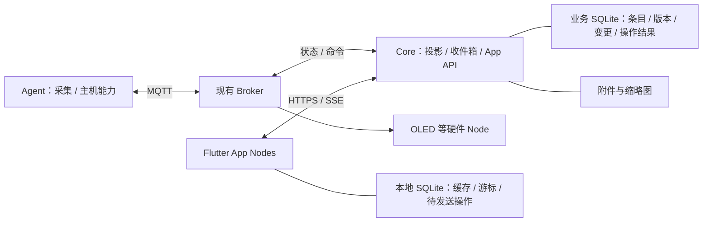

# Orbit App Node 与个人收件箱：实现交接

- 日期：2026-10-07（Asia/Shanghai）
- 代码核对基线：`87ed76ffcbdd8b505d8170259fdaf6b0836220d6`（`v0.1.7`）
- 交接分支：`feat/app`
- 状态：Android 收件箱、持久同步、文本/待办与图片链路已实现；桌面发布验证和后续能力见文末执行进展。原方案保留为背景，当前接口以 [App API v1](app-api.md) 为准。

> 下文方案中的“当前/尚未实现”描述的是 2026-10-07 交接基线；实现后的事实和验证范围见本文末尾“执行进展”，API 和运行方法见新文档。

## 1. 接手目标与决策状态

用户希望先增加 Android App Node：查看消息列表，将周期状态和 session 信息固定在紧凑摘要区展示；随后支持从任意 App Node 发送文本、待办、图片，并在其他 App 中查看、复制、完成或修改。后续 macOS、Windows App 具有相同产品定位，目标用户为个人自用。

用户明确选择：**首版打开 App 后同步，后台通知后续增加。**

本次交接按“不引入 IM、自行实现必要基础能力”的讨论路线展开。下列技术选型是建议实施默认值，不应表述成已经落地或经过三端验证的结果：

| 范围 | 建议默认值 | 决策理由 |
| --- | --- | --- |
| App | Flutter + Dart，Riverpod，Drift/SQLite | 共享三端 UI、缓存与同步逻辑；平台插件仍需逐端验证 |
| Core | 沿用 Go，增加业务存储与 App API | 保留已有采集、投影、硬件与受控命令边界 |
| 服务端存储 | 单实例 SQLite WAL，独立业务数据库 | 适合个人数据规模；与 Agent 读取的 Codex 数据库分开 |
| App 通信 | HTTPS API + 前台 SSE | 支持查询、提交操作、增量同步和附件，符合前台同步目标 |
| Agent / 硬件通信 | 保留 MQTT + Protobuf | 延续现有链路和固件兼容性 |
| 附件 | 服务端文件目录 + 数据库元数据 | 初期无需增加对象存储服务；通过接口保留替换空间 |
| 运行形态 | App API、消息业务与当前 Core 同进程，内部按模块分层 | 控制个人自用部署成本 |

首版不要求后台推送、Android 常驻服务、多用户/租户、联系人/群聊、端到端加密、多 Core 写入、富文本协同或 CRDT。指定设备发送、每设备已读、全文搜索、托盘、全局快捷键可后续增加。

## 2. 当前实现与阅读入口

先阅读 [README](../README.md)、[领域术语](../CONTEXT.md)、[当前设计](design.md)、[MQTT Topic](mqtt-topics.md) 与相关 ADR。根目录 [HANDOFF.md](../HANDOFF.md) 是简短的当前状态与导航入口，已移除过时的架构草稿。

| 现有实现 | 核对入口 | 与本次需求的关系 |
| --- | --- | --- |
| Core 维护内存 canonical state，生成有限的 DeviceView | [engine.go](../internal/core/engine.go) | 用量和 session 可复用；没有用户消息历史 |
| 只接受 OLED/Web 产品与对应 profile；同一路由每种 observation type 最多一个 Agent | [engine.go](../internal/core/engine.go)、[ADR-0018](adr/0018-core-owns-node-data-routing.md) | App 产品和投影需扩展；多主机 session 聚合另行设计 |
| DeviceView 包含 UsageView、CodexView、freshness/expiry | [view.proto](../proto/orbit/v1/view.proto) | 适合固定状态摘要，不适合无限增长的消息列表 |
| Web 缓存最新快照，提供 `/api/state`、SSE `/api/events` | [store.go](../nodes/web/store.go)、[server.go](../nodes/web/server.go) | 可参考实现，当前 SSE 没有持久增量回放 |
| Web 服务使用配置中的一个 node_id；登录令牌未绑定独立客户端设备身份 | [runner.go](../nodes/web/runner.go)、[auth.go](../nodes/web/auth.go) | 不能直接把所有 App 当成同一个 Web Node |
| MQTT clean start，session expiry 为 0 | [client.go](../internal/mqtt/client.go)、[ADR-0008](adr/0008-use-ephemeral-idempotent-v1-commands.md) | 不提供业务消息离线补收或跨重启去重 |
| Intent/Command 仅实现 OpenCodexSession；Web Intent TTL 20 秒，Core 限制最多 30 秒 | [command.proto](../proto/orbit/v1/command.proto)、[commands.go](../internal/core/commands.go) | 不能套用到需要持久保存的消息创建、编辑与完成 |
| Agent 发布 CommandResult；Core 当前未订阅 results 并反馈给 Web | [runner.go](../internal/core/runner.go)、[Agent commands](../internal/agent/commands.go) | UI 的 HTTP 202 不表示主机动作成功 |
| Core MQTT 入站和 DeviceView 上限均为 32 KiB | [runner.go](../internal/core/runner.go) | 图片走 HTTP，消息引用附件 |
| 已有 modernc.org/sqlite，当前用于 Codex Source 只读采集 | [go.mod](../go.mod)、[source.go](../internal/sources/codex/source.go) | 仍需新增业务库、迁移和存储接口 |
| Core 目前先连接 MQTT，再启动 runner | [Core main](../cmd/orbit-core/main.go) | 新 App API 的启动与可用性不能被 Broker 离线无限阻塞 |

本次没有执行 Go/固件运行验证；以上为源码核对。既有测试结果、生产环境和另一台机器的工具链需要在实现时重新验证。

## 3. 目标结构与职责



- **Agent**：继续获取可信主机状态、执行显式 Capability。发送用户文本和待办无需经过 Agent。
- **Core**：用户内容与共享状态的权威来源；持久化后确认操作，控制投影、访问范围和同步。
- **App Node**：展示、本地缓存、用户输入、重试、本机交互。Node 是运行角色，App 可通过 HTTPS 接入。
- **MQTT**：延续 Agent 和硬件链路；业务消息可靠性由持久化和增量同步保证。

Core 内的业务存储与 HTTP 服务应独立于 MQTT 重连生命周期。Broker 暂时不可用时，消息仍可查询和提交；Agent 状态标记 stale，远程动作反馈不可用。

同一台电脑上的 App 和 Agent 分别使用 `node_id`、`agent_id`，不共用 MQTT Client ID 或凭据。

## 4. 产品语义与界面

### 两类数据

1. **状态摘要**：用量、session、更新时间、新鲜度。按稳定标识覆盖更新；过期明确显示 stale；不随每次采集增加消息行。
2. **收件箱条目 Item**：文本、待办、图片。拥有稳定 ID、持久版本和生命周期；与 MQTT Metadata.message_id、DeviceView revision、core_epoch 分开。

界面上方固定紧凑状态区，session 可展开；下方为独立滚动的消息列表。文本支持复制，待办支持完成/撤销，图片支持缩略图和详情。原始周期刷新不产生通知；未来若将 session 完成转换成消息，应另做状态变化检测和去重。

### 操作含义

| 操作 | 建议默认语义 | 执行位置 |
| --- | --- | --- |
| 发送文本/待办/图片 | 自己的所有 App Node 可见，来源端也能看到 | Core 持久化与同步 |
| 完成/撤销待办 | 全局共享状态；提交目标值，不能用 toggle 表达重试操作 | Core 事务 |
| 编辑内容 | 共享修改，携带 expected_revision，冲突不静默覆盖 | Core 事务 |
| 复制文本/查看图片 | 当前设备本地动作，不会全局“消费掉”消息 | App |
| 删除/归档 | 建议全局同步；删除留同步标记，归档仍可恢复 | Core 事务 |
| 已读/本地隐藏 | 可选，按设备保存，不等于待办完成 | 本地或独立设备状态 |
| 打开主机 session | 保留时效和授权，等待执行结果；超时表示结果未知 | Core → Agent |

“所有 App 收到”表示：Core 已保存后，各获授权设备下次同步可以获取；首版不承诺锁屏或进程被杀时立即通知。硬件只接收其支持的投影，不强制接收图片和完整历史。

## 5. Core 新增模块

| 模块 | 责任与首版边界 |
| --- | --- |
| 设备管理 | 稳定 node_id、名称、平台、版本、能力；独立凭据与撤销；初期可用受控的设备令牌发放流程，配对 UI 后补 |
| 收件箱业务 | 创建/读取/编辑/完成/撤销/删除；字段校验；默认单用户共享收件箱 |
| 存储 | SQLite WAL、schema migration、事务与索引、数据库路径配置、备份恢复 |
| 同步 | 一致快照、持久增量序号、删除标记、操作去重、版本冲突、游标失效恢复 |
| App API | HTTPS JSON API、设备鉴权、错误码、分页、请求尺寸约束、SSE 生命周期 |
| 附件 | 上传暂存/完成、元数据、受鉴权的下载、缩略图、未引用文件清理 |
| App 投影 | 为 HTTP Node 提供经 Core 路由与隐私裁剪的用量/session 摘要，不要求 App 冒充 Web MQTT 产品 |
| 动作结果桥接 | 实现远程动作时接入 Agent results，用 intent/command ID 关联到来源 Node，并区分提交与执行状态 |

建议新增内部模块，如 `internal/inbox`、`internal/storage`、`internal/sync`、`internal/devices`、`internal/attachments`、`internal/appapi`，由 `cmd/orbit-core` 装配；名称可调整。业务逻辑不依赖 HTTP handler 或 Flutter。

建议共享 App 工程放在 `nodes/app/`，由同一工程生成 Android/macOS/Windows 产物。这些路径目前均为规划，不是已有模块。

### 数据对象草案

| 对象 | 必要字段或约束 |
| --- | --- |
| Device | node_id、label、platform、capabilities、credential digest、revoked_at |
| Item | id、kind、body、todo_status（适用时）、created_by_node_id、revision、created_at、updated_at、deleted_at；图片引用 attachment ID |
| Attachment | id、storage_key、MIME、size、dimensions、thumbnail_key、upload state、created_at |
| Change | 单调递增 seq、item_id、item_revision、变更后的完整条目或删除标记；首版用完整条目降低应用复杂度 |
| OperationReceipt | `(node_id, operation_id)` 唯一、规范化请求摘要、已提交结果；同 ID 不同内容必须拒绝 |
| Sync metadata | 数据集 generation、可用增量下界；正常进程重启不改变 generation |
| DeviceItemState | 可选，`(node_id, item_id)` 对应已读/本地隐藏等设备状态 |

关系使用逻辑 ID 和查询所需索引，**不创建物理 FOREIGN KEY**。引用校验、依赖更新、删除语义放在应用事务中。全局已完成状态不能放入 DeviceItemState。

设备能力声明只用于兼容与展示，不自动授予权限。Node 身份从凭据解析，不能信任请求正文里的任意 node_id。凭据保存在系统安全存储中；服务端避免保存明文令牌，日志不打印正文、图片或凭据。

## 6. 必须保持的同步不变量

### 写入与重试

1. App 生成稳定 operation_id，将操作保存到本地待发送队列；进程重启后仍可重试。
2. Core 校验设备和请求，查找已提交 OperationReceipt，再进行 expected_revision 检查。
3. 在同一个数据库事务中修改 Item、追加 Change、保存成功操作结果。
4. 事务提交后才返回成功并发出更新通知。Broker/SSE 收到数据不等于业务已提交。
5. 已提交但响应丢失时，重试返回原结果，不再次创建条目或追加相同业务变更。
6. 相同条目的本地操作按依赖顺序提交。一次已经发出的 operation 内容不可原地修改；新的用户修改使用新的 operation_id。

首版保留去重结果，避免过早清理。后续若设置保留期，必须定义过期操作拒绝或恢复规则，不能因去重记录被清除而重新执行旧操作。

### 读取与增量

- Item revision 用于并发检查；Change seq 用于补同步。不要用设备时间、列表排序时间或 core_epoch 替代游标。
- 初始快照与其 high-water cursor 必须来自一致数据边界。分页快照不能跳过过程中发生的编辑和删除；实现时选择一致快照方案并用并发测试证明。
- 按 seq 有序应用变更；本地缓存与 applied_cursor 在同一事务中提交。重复下载可安全重放，旧版本不能覆盖新版本。
- SSE 建议作为“有更新”的提示；收到提示不能直接推进 applied_cursor。首次先建立通知订阅再追赶增量，重连/回前台也重新追赶；连接心跳可携带服务端 high-water 以发现漏通知。
- 用户条目变更与临时状态摘要使用独立的游标/版本语义，状态刷新不能推进消息已应用游标。
- 删除用 tombstone 传递；清理变更历史时维护最早可用游标。游标过旧明确返回 reset_required，客户端重新取快照并清理已删除缓存。
- 正常 Core 重启不清零游标。备份恢复到旧数据集时需要改变 sync generation 或显式要求 reset，避免设备拿着旧的较大游标永远看不到更新。

### 冲突与离线

- 首版采用整条 Item 乐观并发控制：提交 expected_revision，冲突返回服务端最新条目；保留本地草稿供用户处理。
- 目标状态操作使用 `set_completed(true/false)`，避免 toggle 重试反转。
- UI 从本地数据库读取；权威快照与本地待提交修改分开，后台同步不能悄悄抹掉草稿。
- 展示“待发送 / 已保存 / 失败 / 冲突”，其中“已保存”明确指 Core 确认持久化。
- 不需要为用户内容复用当前 20/30 秒 Intent TTL；远程主机命令继续保留短时语义，不能离线几小时后自动打开旧 session。

## 7. API 与附件交付边界

以下是待实现的 API 形状，不是当前可调用端点。具体命名可调整，但需要固定错误和版本契约，并保存到仓库供客户端共用。

| 建议接口 | 用途 |
| --- | --- |
| `GET /api/v1/status` | 当前设备获授权的用量/session 摘要 |
| `GET /api/v1/items` | 按稳定排序和游标分页浏览；列表分页游标与同步游标分开 |
| `GET /api/v1/sync/snapshot` | 初始化或 reset，返回一致快照及其 generation/cursor |
| `GET /api/v1/changes?after=...` | 有序增量、next_cursor、has_more、reset_required |
| `GET /api/v1/events` | 前台更新提示、连接心跳与状态摘要更新；使用设备鉴权 |
| `POST /api/v1/operations` | 类型化 create/update/set_completed/delete，operation_id 与 expected_revision |
| `POST /api/v1/attachments` | 上传并返回可引用的附件 ID |
| `GET /api/v1/attachments/{id}` | 受鉴权的原图/缩略图读取 |

设备令牌发放/配对/撤销接口、远程动作接口在对应里程碑中确定。App 首版可用受控配置发放令牌，不需要先建设账号注册和密码找回。

至少区分未认证、设备已撤销、字段错误、版本冲突、操作 ID 被复用、附件未完成/不可访问、游标失效和暂时不可用。整数 revision/cursor 采用跨 Dart/JavaScript 精确往返的表示（例如不透明字符串），不要依赖 JS number 的大整数精度。

附件先完成上传，再创建引用它的条目。失败上传和未引用暂存文件按规则回收；仍被有效条目引用的原图不能误删。下载端按需取原图、缓存缩略图。上传与消息提交需要独立可见的重试状态，MQTT 中不塞图片或 Base64。

部署需增加持久数据卷、附件目录、HTTP 监听与反向代理配置。数据库和附件一起纳入备份；WAL 模式下使用一致备份方式或停机备份，不能只随意复制正在写入的主数据库文件。业务库、上传文件、设备凭据和本地配置应加入忽略规则，不提交真实数据。

## 8. 客户端公共能力与平台差异

公共层实现设备接入、鉴权、本地数据库/迁移、API client、同步协调器、待发送队列、冲突处理、附件缓存、状态区、列表与详情。Android 回前台/网络恢复时追赶同步；各桌面端复用相同规则。

| 端 | 基础交付 | 后续增强 |
| --- | --- | --- |
| Android | 安全凭据存储、前台同步、文本剪贴板、系统图片选择、预览；可安装 APK | 接收系统分享、通知按钮、推送 |
| macOS | 共用 UI/同步、剪贴板、文件选择、键盘交互、窗口状态 | 菜单栏、快捷键、拖放、通知、分享入口 |
| Windows | 共用 UI/同步、剪贴板、文件选择、键盘交互、窗口状态 | 托盘、快捷键、拖放、通知、开机启动 |
| Web | 初期保留现有状态页；接入收件箱时复用相同业务 API，并明确浏览器设备身份 | IndexedDB 离线缓存、浏览器通知 |
| Agent | 保持现有采集与 Capability；用户消息无需安装额外 Agent | 主机动作结果完善，新增平台的采集/执行适配 |
| OLED | 保持现有用量展示 | 经 Core 投影待办数/最新消息摘要，按钮操作按能力另行实现 |

Flutter 的系统插件是否覆盖三端、最低系统版本、打包签名方式要在实现时核实。macOS 构建需要对应工具链，Windows 产物应在 Windows 环境/CI 构建验证；Android 首版通过真实设备或模拟器验证，不能只用桌面预览代替。

## 9. 与既有协议和 ADR 的关系

- [ADR-0010](adr/0010-keep-mqtt-as-core-transport.md) 的“V1 唯一基础设施/内存状态”需要新增 ADR 说明本次持久业务需求与 HTTP 接入边界，不应默默改变既有文档。
- [ADR-0015](adr/0015-core-processes-only-new-observations.md) 可以继续适用于临时 Observation；用户 Item 明确跨重启恢复。
- [ADR-0008](adr/0008-use-ephemeral-idempotent-v1-commands.md) 继续约束旧 Agent 命令；业务 Operation 是新的持久事务契约。
- [ADR-0018](adr/0018-core-owns-node-data-routing.md) 的 Core 路由与隐私边界保留；App 用户输入不会成为自报 Agent 路由授权。
- App 身份在 Core 设备模块登记。不要让 HTTP App 冒充 `display/web/browser`，或为了接受它直接取消产品与授权校验。
- 按 [ADR-0017](adr/0017-version-breaking-protocol-changes.md) 处理不兼容 MQTT/Protobuf 改动。优先通过新增 App API 演进；若改变 Protobuf，运行生成器并验证固件消费者。
- 当前同一路由不聚合多个 Agent 的同种观测。若将来一个面板要展示多台电脑的 session，需新增聚合模型与稳定来源标识；本次不假设已有此能力。

## 10. 建议里程碑与验收

### M0：建立基线与契约

- [x] 阅读本文和当前代码，在下一台机器核对工作区、工具链和现有测试。
- [x] 记录选定的 Flutter/插件版本、App 工程位置、业务数据路径与部署方式。
- [x] 增加 App 接入/持久化 ADR，确定 Item、Operation、Change 与鉴权契约。
- [x] 准备不含私人内容的固定样例数据；当前没有用户消息来源，查看端验收需可重复的 seed/测试 fixture。

### M1：Android 查看端与同步底座

- [x] Core 设备凭据、数据库/迁移、一致快照、增量读取、状态 API/SSE。
- [x] Android 设备配置、安全凭据存储、本地缓存、回前台同步、固定摘要区和分页列表。
- [x] 使用样例文本、待办和附件元数据验收列表与详情；显示 stale/离线状态，复制文本可离线完成。
- [x] Core 重启后样例条目仍存在；杀掉 App 后重开可先看到缓存，再追赶增量。

M1 是只读里程碑，不表示已经支持从 App 创建消息或完整图片上传；可靠写入闭环在 M2/M3 完成。

### M2：文本与待办的跨设备操作

- [x] 创建/编辑/完成/撤销/删除，持久操作去重、版本冲突和删除同步。
- [x] 客户端待发送队列、明确的保存状态、离线编辑草稿、失败重试。
- [x] 用两个独立 node_id 的客户端或集成测试完成端到端验证；所有业务修改经 Core。
- [ ] 如开放 session 远程操作，补齐 Agent result 回传及超时/失败 UI。（本次未开放，沿用后续范围。）

### M3：图片、桌面端与运行交付

- [x] 图片上传/下载/缩略图/缓存/孤立文件回收，正文与附件引用的一致性。
- [ ] macOS、Windows 使用同一 App 核心，分别验证剪贴板、文件选择和打包产物。
- [x] 持久数据卷、备份恢复、设备撤销、日志与错误码、配置示例和运行文档。

### 后续

Android 分享入口、推送、桌面托盘/快捷键、按设备已读、指定设备投递、硬件消息摘要。推送只触发提醒或同步，仍通过持久 API 补齐内容。

### 必测失败场景

| 场景 | 验收结果 |
| --- | --- |
| 服务端提交成功但 HTTP 响应丢失，App 重试 | 只有一条条目/一次业务变更，返回相同提交结果 |
| 相同 operation_id 提交不同内容 | 明确拒绝，不悄悄覆盖 |
| Core 在条目写入与变更记录之间异常 | 同一事务全部提交或回滚，不出现已保存但无法同步的条目 |
| 设备离线期间其他设备编辑/完成/删除 | 恢复后状态正确，删除内容不会复活 |
| 两端基于同一旧版本同时编辑 | 一个成功，另一个明确冲突且草稿保留 |
| 快照分页/建立 SSE 期间发生修改 | 不丢更新；重复记录不会覆盖更高版本 |
| App 应用变更中途崩溃 | 缓存与游标一致，重启继续补同步 |
| Core 正常重启、增量历史过期、恢复旧备份 | 分别正常续传、显式 reset、识别数据集变更后重建缓存 |
| Broker 不可达 | 消息 API 仍能工作，采集摘要 stale，主机动作明确不可用 |
| 设备凭据撤销、冒用其他 node_id、读取不可访问附件 | 服务端拒绝，正文和凭据不进入日志 |
| 图片上传中断或上传成功但条目未创建 | 可重试，暂存文件能回收，有效引用文件保留 |

## 11. 换机后启动与验证

从已同步的 `feat/app` 分支接手；仓库路径以新机器实际 checkout 为准。真实配置、证书、设备凭据和运行数据通过私有渠道配置，不从交接文档恢复。

在仓库根目录核对现有基线：

```sh
git status --short
git log -3 --oneline
go version
go mod download
make test-go
make build-go
```

当前 [go.mod](../go.mod) 要求 Go 1.27.0；检查实际工具链后再处理安装。上面的命令属于接手验证步骤，不表示本次交接已执行。

实现 App 后增加并运行 `flutter analyze`、`flutter test` 与 Android 构建；具体命令和最低 SDK 随工程写入 `nodes/app/README.md`。Go 写入/同步模块增加前述失败场景的事务和集成测试，关键并发路径运行 race 检查。

若更改协议，运行现有 `make generate`、`make proto-lint`；涉及硬件消费者时再执行 `make test-node`、`make build-node`。完整现有验证入口是 `make verify`，它需要 Go、Buf、Python/uv、PlatformIO 等对应环境。纯文档提交只做链接、内容和 diff 检查。

相关既有启动入口是 `make dev-agent`、`make dev-core`、`make dev-web`，配置规则见 [README](../README.md)。新增 App 与 API 配置应补充示例和 Make 命令；不要假设当前 `make dev` 已包含 Web 或未来 App。

可直接交给下一位实现者的任务：

> 阅读 `docs/app-node-handoff.md`，按不引入 IM 的个人收件箱方案，从 M0/M1 开始实现 Android App Node 与 Core 持久化同步底座。按文档区分已存在能力、用户明确需求和建议默认值；保留既有 Agent/OLED/Web 行为。首版只要求打开 App 后同步，后续按 M2/M3 增加文本/待办操作、图片及 macOS/Windows。每个里程碑更新本文清单，记录实际运行的检查、结果与未完成项，不把模拟测试表述为真实设备或生产验收。


## 执行进展

### 2026-10-07 16:52（Asia/Shanghai）— Android 首版已验证

- 实现：`internal/inbox` 持久条目/事务/回执/变更/附件元数据，`internal/appapi` 设备鉴权、JSON API、SSE、图片文件与清理，Core 可选 HTTP 启动独立于 MQTT。设备按配置发放/撤销，令牌仅保存摘要。App 使用独立 `overview-app` 路由，拒绝 MQTT 产品冒充。
- App：`nodes/app/`，Flutter 3.44.8 / Dart 3.12.2；ChangeNotifier + sqflite 简化原建议栈。固定状态摘要、可展开会话、分页列表、文本/待办/图片、复制、编辑、删除、离线缓存与队列、冲突草稿、安全令牌存储、前台 SSE/定时追赶均已接入。无后台推送，无主机会话远程动作入口。
- 服务端证据：`go test ./...`、`go vet ./...`、`go build ./...` 通过；`go test -race ./internal/inbox ./internal/appapi ./internal/core ./internal/config` 通过。覆盖重复提交及重启回执、操作 ID 复用、双写冲突、事务注入失败回滚、固定边界分页、删除、generation reset、鉴权/撤销/身份注入、私有未引用附件、有效引用的清理保护及 App 路由隔离。
- 客户端证据：`flutter analyze` 无问题，`flutter test` 7 项通过（持久队列/游标原子性/旧回执/冲突草稿/分页中断/360 与 900 逻辑像素布局）。`scripts/app-smoke.py` 在 Android 8 / API 26 ARM64 模拟器通过真实 Go API 端到端测试，覆盖连接、安全存储、前台同步、离线文本、待办、两设备冲突、图片上传和原图/缩略图读取。测试 Core 的 Broker 故意不可达。
- 冷启动检查：停止 Core 后强制结束并重开 Android App，缓存仍可读；离线新增后再强制结束重开，待发送记录仍保留；恢复 Core 后仅保存一次，原有条目也仍存在。Android 8 系统 SQLite 不支持 JSON1/新版 UPSERT，本地缓存已使用兼容查询，模拟器验证通过。
- 交付：`nodes/app/build/app/outputs/flutter-apk/app-debug.apk` 为可安装调试包；[实际界面截图](../nodes/app/docs/android-inbox.png)。配置与操作见 [App README](../nodes/app/README.md)、[API 契约](app-api.md)、[部署/备份](app-operations.md)、[ADR-0021](adr/0021-app-inbox-over-http.md)。Compose 配置校验与 diff 检查通过。
- 边界：macOS/Windows 工程复用同一业务与 UI，但未完成平台验收；macOS 构建停在缺少开发签名配置（Keychain entitlement 需要），本机无法生成 Windows 产物。未做物理真机、生产 Broker/HTTPS、生产备份恢复或正式签名发布验收。M3 桌面交付仍未完成。
- 工具环境：本机 Homebrew Flutter 可执行文件启动异常，本次使用仓库忽略目录 `.tools/flutter` 的本地 SDK 副本完成检查；SDK 未纳入源码。命令可通过 `FLUTTER=/absolute/path/to/flutter` 选择可用 SDK。

### 2026-10-08 — 增加 Android App CI

- 新增 `.github/workflows/build-app.yml`：App/Makefile/工作流相关的 PR 和 main 推送触发，另支持 `v*` 标签及手动运行。使用固定 Flutter 3.44.8、Java 17，安装锁定依赖，执行 `make test-app build-app`，上传 `orbit-android-debug` 调试 APK，保留 14 天。
- 验证：`actionlint`、`git diff --check`、锁定依赖安装通过；本地复跑 Make 命令，静态分析、7 项测试和 APK 构建通过。尚未提交/推送本次工作流，未宣称 GitHub runner 已运行成功。
- CI 当前覆盖 Android；macOS/Windows 平台构建及正式签名发布仍待补充。
