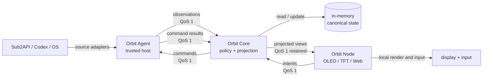
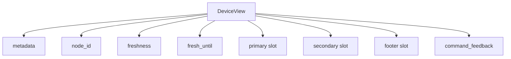
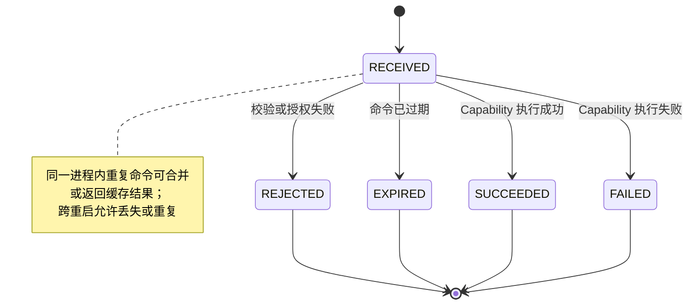
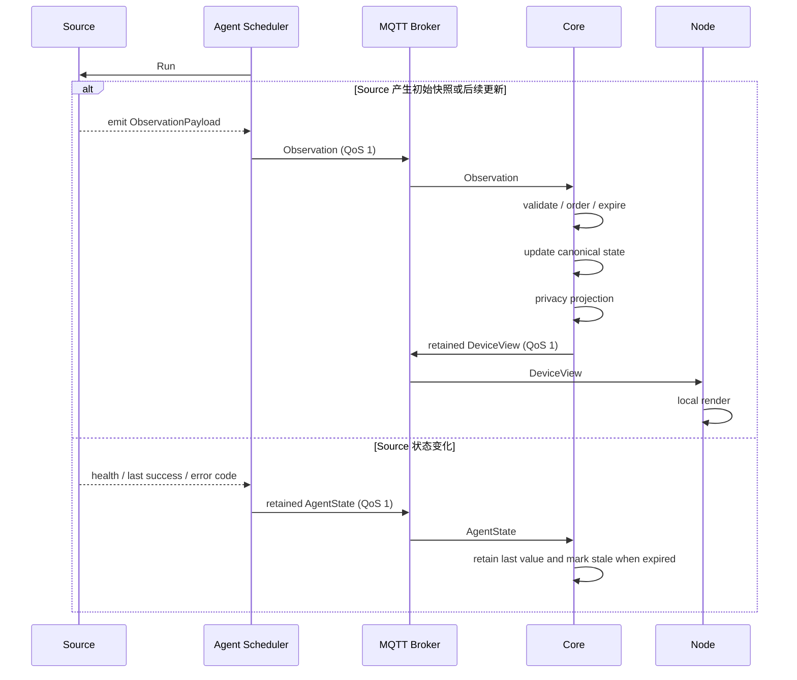

# Orbit 总体设计

> 状态：Draft  
> 更新时间：2026-09-03  
> 依据：[项目交接说明](../HANDOFF.md)

## 1. 文档目的

本文定义 Orbit 首个可用版本的系统结构、模块接口、消息契约、运行时流程、故障语义与验收边界，用于指导后续协议和代码实现。

本文不替代具体的 Protobuf 文件、MQTT ACL、部署清单或硬件接线说明。它们应在实现阶段成为本文设计的可执行产物。

## 2. 背景与目标

Orbit 是个人设备与能力网络。它连接可信主机、云端消息通道以及 OLED、TFT、Web 等节点，使主机能够发布经过整理的状态，并执行协议明确允许的命令。

首个版本需要证明一条完整闭环：

1. 主机上的 Orbit Agent 采集本地状态。
2. Orbit Core 将状态投影为设备可消费的语义视图。
3. ESP32 OLED 节点通过 MQTT 接收并渲染最新视图。
4. Node 或可信客户端发送受限 Intent，由 Core 生成类型化命令。
5. Agent 尝试执行短生命周期、可重复的 Capability，并在进程仍存活时返回可关联结果。

工程验证里程碑 M0 可以使用合成 Observation 和无副作用的 `PingAgent` Capability 验证完整消息闭环；首个可用版本 V1 必须接入真实、脱敏的 UsageObservation，并在 OLED 128x32 上展示用量。V1 产品范围不包含 Intent 或真实动作能力；Codex 集成和 OLED 输入也不属于 V1。

### 2.1 设计目标

- 设备只理解 Core 为其 Device Model 生成的紧凑文本视图，不理解上游系统的私有数据结构或格式化规则。
- 命令能力是显式白名单，不形成远程 Shell。
- MQTT 重复投递、离线重连和乱序到达不会导致状态回退；V1 Command 只允许重复执行不会产生额外副作用的动作。
- Core、Agent 与 Node 可以独立演进；Agent 与 Core 从首版起保持独立进程和身份。
- 在网络不稳定时保留最后一个可用画面，并明确标记过期状态。
- 所有发送到设备的数据都经过隐私裁剪。

### 2.2 非目标

- 通用远程执行平台。
- 由云端生成像素帧或统一控制各设备的页面导航。
- 以 MQTT retained message 充当历史数据库。
- V1 引入 PostgreSQL、Redis 或其他外部数据库。
- 首版支持任意第三方插件、动态脚本或用户自定义命令字符串。
- 首版实现跨区域高可用、复杂多租户或大规模设备编排。

## 3. 关键约束

| 领域 | 约束 |
| --- | --- |
| 后端与主机端 | Go |
| V1 Agent 平台 | macOS；Windows 和 Linux 不在 V1 支持范围 |
| V1 Core 平台 | 长期在线的 Linux 主机；开发时允许在 macOS 本地运行 |
| 结构化协议 | Protocol Buffers，包名从 `orbit.v1` 开始 |
| 消息传输 | EMQX Cloud Serverless 上的公网 MQTT 5；默认 TLS，允许配置显式关闭，禁止自动降级 |
| 网络边界 | 一个专用 Broker 部署对应一个 Orbit Network；V1 不增加 `tenant_id` 或 `network_id` |
| 命令模型 | `oneof` 类型化动作，禁止 `google.protobuf.Any` 和任意命令字符串 |
| 设备数据 | 只发送语义视图，不发送提示词、正文、终端输出、凭据或任意本地路径 |
| 投递语义 | MQTT QoS 1；同一进程内按 `command_id` 做有界去重，跨重启允许 Command 丢失或重复 |
| 身份 | 每个 Agent、Core、Node 使用独立身份和最小权限 ACL；Core ID 与 Node ID 必须显式配置，Agent ID 允许从本机稳定信息生成默认值，Host Label 只供人辨认 |

## 4. 总体结构



### 4.1 模块划分

#### Orbit Agent

Agent 是运行在可信主机上的深模块实例，通常一台机器只运行一个。外部接口是“注册 Source、注册 Capability、启动/停止”；数据获取、连接恢复、命令校验、去重、执行和结果发布隐藏在实现内部。

职责：

- 启动并管理多个已注册 Source；各 Source 自行封装本机读取、远端 API 或事件订阅方式。
- 发布 Observation、retained AgentState 和 Agent presence。
- 接收只发往自身 `agent_id` 的命令。
- 在执行前完成解码、版本、目标、时效、授权上下文和参数校验。
- 使用有界内存记录抑制同一进程生命周期内的重复 Command；不承诺跨重启恢复。
- 通过已注册 Capability 执行类型化动作，并发布状态变化和最终结果。

#### Orbit Core

Core 是状态与策略模块，接口是“接收观测或 Intent，发布 canonical state、device view 或 command”。它不依赖显示几何，也不解释任意命令负载。

职责：

- 通过 MQTT 接收 Agent 发布的 Observation 和 retained AgentState；Source 不以独立身份接入 MQTT。
- 从 retained AgentState 和新 Observation 动态发现 Agent，不维护 Agent 注册表或 allowlist。
- 按生产者、修订号和过期时间维护最新 canonical state。
- 从 YAML 加载按 `node_id` 显式配置的 Projection Route，按 Node 选择 canonical state，再应用优先级、隐私、过期与设备策略，生成已经格式化文本的 DeviceView。
- 将受支持的 Intent 映射为类型化命令并路由到目标 Agent。
- 通过 MQTT 发现 Node，并根据其协议自描述选择受支持的投影。
- 从 YAML 加载投影策略和其他本地配置，并在 V1 运行期间保持只读。
- 发布 retained view；V1 不持久化 canonical state 或历史。

#### Orbit Node

Node 是设备接入 Orbit 网络后承担的运行时角色，不是硬件产品名称。带 OLED/TFT 的物理 Node 归入 Device Series；Web 等软件 Node 也可以使用同一协议，但不强制套用硬件型号体系。

职责：

- 使用设备独立凭据连接 MQTT。
- 每次启动生成随机 `node_epoch`，发布 retained NodeState，报告该 Epoch、`node_id`、产品身份和固件版本，不依赖 Core 中的预注册记录。
- 订阅自己的 retained view，并把 Core 生成的文本行映射到本地字体与像素位置。
- 不选择、不订阅也不展示上游 Agent；数据来源与分流完全由 Core 的 Projection Route 决定。
- 数据过期时保留最后可用内容，同时呈现 stale 状态。
- 可选地将按钮、触摸等输入发布为有限的 Intent。
- 在支持输入的后续版本中呈现 Core 投影的发起者专属命令反馈；V1 OLED 不呈现产品命令状态。

### 4.2 首版部署形态

Agent 与 Core 从首版起作为两个独立 Go 进程运行，并通过 MQTT 使用正式消息契约通信。两者使用独立身份和凭据；不提供隐藏该边界的进程内传输模式。V1 正式环境在一台长期在线的 Linux 主机运行 Core，开发时允许在 macOS 本地运行；Core 只主动连接公网 MQTT，不开放公网入站服务。V1 只允许一个活动 Core，同一 `core_id` 派生相同 MQTT Client ID，由 Broker 在新连接建立时替换旧连接。Core 是唯一可以构造和发布 DeviceView、生成和发布 Command 的参与者，Agent 不能让 Source 直接构造或发布设备视图。参见 [ADR-0001](adr/0001-separate-agent-and-core-processes.md) 和 [ADR-0002](adr/0002-core-owns-views-and-commands.md)。

### 4.3 设备产品模型

物理边缘设备使用四层模型，避免把业务用途、芯片、屏幕驱动和实例位置拼成一个不稳定的长名称：

| 层级 | 定义 | 示例 |
| --- | --- | --- |
| Device Series | 共享产品定位、交互范式和固件主干的一组设备 | `display` |
| Device Model | Series 内稳定的显示与交互能力组合 | `oled-128x32` |
| Hardware Variant | 同一 Model 的开发板、引脚或器件装配差异 | `yd-esp32-s3` |
| Node Instance | 已发放 `node_id` 和凭据、实际接入网络的物理或软件 Node | `desk-oled-01` |

物理 Node 的四层标识必须作为独立字段保存。完整身份由结构化数据表达，不把产品信息重复拼进 `node_id`。软件 Node 只有 Node Instance 身份，不强制归入硬件产品层级。其中：

- `series_id` 和 `model_id` 由项目维护，发布后保持稳定。
- `variant_id` 对应构建目标和硬件配置，不影响 DeviceView 的业务语义；V1 只承诺 `yd-esp32-s3`，`esp32s3-devkitc` 是未验证候选。
- `node_id` 在凭据发放时确定，只要求在部署范围内唯一，不承担型号描述。
- `core_id` 和 `node_id` 必须在部署配置中显式给出，使用与手动 Agent ID 相同的格式限制；它们不从硬件自动生成。
- Node 上报自身 Series、Model、Variant 和固件版本；Core 据此校验兼容性并选择投影能力。

### 4.4 Orbit Display Series

首个设备系列定名为 **Orbit Display**，规范标识为 `display`。它覆盖 OLED、TFT 及后续同类小型状态显示设备，共享以下能力：

- 订阅型号专属的文本 DeviceView，并在本地完成固定行位、字体和像素渲染。
- 保留最后可用画面并呈现 fresh/stale/offline 状态。
- 根据具体 Model 声明显示尺寸、颜色能力和输入能力。
- 可选地发布按钮或触控 Intent，并显示关联的命令反馈。

首个 Device Model：

| 属性 | 值 |
| --- | --- |
| 展示名称 | Orbit Display OLED 128×32 |
| `series_id` | `display` |
| `model_id` | `oled-128x32` |
| 显示器 | SSD1306，128×32，单色 OLED |
| 主控平台 | ESP32-S3 |
| Hardware Variant | YD-ESP32-S3 |
| 首个用途 | 展示 Token 用量等紧凑指标 |

原 `sub2api-usage-esp32s3` 的名称同时绑定了数据来源和芯片，不适合作为长期设备身份。迁入 Orbit 后：

- 固件/目录按 `display/oled-128x32` 组织。
- PlatformIO 环境名只表达 Variant；V1 只有 `yd_esp32s3`。
- Sub2API 用量是 `UsageObservation` 投影出的内容，不属于 Series、Model 或固件名称。
- 对外展示名称允许带 `Orbit` 品牌前缀；协议与目录标识不重复携带 `orbit`。

## 5. 核心接口

以下接口用于说明模块形状，最终命名可随 Go 包结构微调。

```go
type Source interface {
	Run(ctx context.Context, emit func(ObservationPayload) error) error
}

type Capability interface {
	Execute(ctx context.Context, action Action) (CapabilityResult, error)
}

type Projector interface {
	Apply(ctx context.Context, observation Observation) ([]DeviceView, error)
}
```

接口约束：

- `Source` 通过 Agent 提供的回调提交领域观测，不直接发布 MQTT 消息；无论数据来自本机、远端 API 还是事件订阅，都由承载它的 Agent 使用自身身份封装并发布 MQTT Observation。
- `Capability` 只接收 Agent 已验证并转换后的类型化动作。
- `Projector` 是隐私与设备投影的唯一入口；调用者不能绕过它发布 DeviceView。
- Source 使用可取消的长运行接口，并全部运行在 Agent 内；数据获取是 Agent 职责，不是由 Command 调用的 Capability。不存在独立的 Backend Source 参与者或 `source_id` MQTT 身份。
- 同一 Agent 不允许注册两个产生相同 Observation 类型的 Source；V1 的逻辑 Observation 流只由 `(agent_id, observation_type)` 标识。
- MQTT、Codex、Sub2API 和具体存储实现是各自 seam 上的 Adapter。
- 只有确实存在第二种实现或测试替身时才抽取额外接口。

## 6. 协议模型

### 6.1 公共元数据

所有顶层消息携带统一的 `Metadata`：

| 字段 | 含义 | 约束 |
| --- | --- | --- |
| `message_id` | 本次消息实例 ID | 全局唯一，用于追踪，不承担命令幂等 |
| `producer_id` | 生产者身份 | 必须与 MQTT 认证身份和 Topic ACL 相符 |
| `revision` | 同一逻辑对象的单调修订号 | 消费者拒绝低于当前值的状态更新 |
| `produced_at` | 生产时间 | UTC 时间戳 |
| `expires_at` | 可选的应用层过期时间 | Observation、Command 和 Intent 必填；参与者 State 与 Presence 不使用 |

设备不能仅依赖本地墙钟判断乱序，应先比较 `revision`，再使用 `expires_at` 判断时效。Agent Observation 还携带每次进程启动时随机生成的 `agent_epoch`；同一 `(agent_id, agent_epoch, observation_type)` 内的 revision 从 1 单调递增。

### 6.2 Observation 与 Canonical State

Observation 表达某个 Source 在某一时刻观察到的事实，不包含设备布局。M0 支持 `SyntheticObservation`；V1 只要求 `UsageObservation`，表达 Sub2API 等来源的额度、成本、Token 和 TPM 摘要。

`SystemObservation` 和 `CodexObservation` 在 V1 之后按真实需求加入。

V1 的 `UsageObservation` 只包含当前产品需要的字段：

| 字段 | 含义 | 约束 |
| --- | --- | --- |
| `window_start` / `window_end` | 本次累计统计窗口 | Source 已处理上游时区语义后的完整 UTC 时间戳 |
| `actual_cost_micros` | 窗口内实际成本 | `int64`，禁止在线协议使用浮点金额 |
| `currency_code` | 成本币种 | 必填 ISO 4217 代码 |
| `token_count` | 窗口内 Token 数 | `uint64` |
| `tpm` | 采集时的每分钟 Token 速率 | `uint64` |
| `observed_at` | Source 实际完成采集的时间 | UTC 时间戳，与消息生产时间区分 |

V1 的 Usage Source 在当前 Orbit 仓库中实现，由 Agent 承载并以该 Agent 的身份向 Core 发布类型化 Observation。

上述 V1 字段全部必填；不增加窗口时区字段，日期边界和上游时区语义由 Source 在采集时处理。数值 `0` 是有效业务值，不能表示“未提供”，因此 Protobuf schema 必须保留数值字段的 presence。成本数值与币种必须组成有效组合，且 `window_start < window_end`。任何必填字段缺失、币种无效或窗口无效都会拒绝整条 UsageObservation，不做部分 canonical state 更新或部分投影，之前接受的 canonical state 保持不变并按原 `expires_at` 自然过期。

Core 依据 `(producer_id, observation_type)` 识别逻辑对象。它先从 retained AgentState 确认当前 `agent_epoch`，再只接受该 Epoch 内 revision 更新的 Observation；Agent 的 `producer_id` 就是 `agent_id`，协议中不存在 `source_id` 或 `subject_id`。Canonical State 是 Core 内部模型，不直接承诺为公共线协议。

Source 提供事实的 `observed_at` 和建议有效期，Agent 根据对应 Source 配置生成最终 `expires_at`。Core 为每种 Observation 类型配置最大允许 TTL 和最大未来时钟偏差；超出允许偏差的未来 `observed_at` 会导致整条 Observation 被拒绝。通过校验后，有效过期时间取 payload `expires_at`、`observed_at + max_ttl` 和 Core 接收时间加 `max_ttl` 三者中最早者；接收时已经过期的 Observation 不进入 canonical state。DeviceView 的 `fresh_until` 取所有参与投影的 Observation 中最早的有效过期时间，Presence 不参与 freshness 计算。

Core YAML 中每条 Projection Route 以 `node_id` 为键，指定一个 View Profile 和该视图所需的 `(agent_id, observation_type)` 输入。V1 允许一张 View 组合不同 Observation 类型，但同一类型最多选择一个 Agent；Core 不根据发现顺序自动选 Agent，也不隐式聚合多个 Agent。NodeState 用于发现和能力自描述，Projection Route 只控制数据投影，不代替 Broker 准入。

Observation 是可替换的最新状态快照，不是必须逐条消费的事件流。Agent 的发布边界和 Core 的处理边界都按 `(agent_id, observation_type)` 最多保留一条尚未处理的 Observation；更高 revision 到达时覆盖尚在等待的旧值。正在处理的值不被中断，revision 出现跳号属于正常现象，任何边界都不得建立无界 Observation 队列。

### 6.3 DeviceView

DeviceView 是 Core 面向某个 Node Instance 生成的型号专属文本视图。Core 负责选择上游 canonical state，并完成数值格式化、单位、文本内容、顺序和有限强调语义；Node 不接收原始 Metric、上游 Agent 身份或云端像素帧。

Core 每次启动生成随机 `core_epoch`，DeviceView 携带该值并在同一 Epoch 内使用递增 revision。Node 接受新 Core Epoch 的首个 View，随后拒绝该 Epoch 内较低的 revision。Core 不恢复上一 Epoch 的 canonical state，也不以旧 retained DeviceView 作为输入；只有 Core 启动后收到的新 Observation 才能产生新 Epoch 的 View。参见 [ADR-0015](adr/0015-core-processes-only-new-observations.md)。



首版应限制：

- 最大编码尺寸。
- Primary、Secondary 和 Footer 各槽位字符串的最大 UTF-8 字节数。
- 枚举未知值的降级行为。
- 固件端静态内存预算。

OLED 128x32 的 DeviceView 固定为 Primary、Secondary 和 Footer 三个槽位，不接受任意数量的文本行。Core 为各槽位决定文本、缩写和有限强调语义；Node 只把槽位映射为固定字体、截断规则和像素布局。本文只固定槽位概念，不决定 Usage 字段到槽位的映射、具体文案或字节上限；这些内容在实现显示功能前单独设计。参见 [ADR-0009](adr/0009-core-formats-display-text.md)。

### 6.4 Command 与 CommandResult

Command 使用 `oneof action` 形成能力白名单。M0 只实现无破坏性的 `PingAgent` 测试能力；V1 不提供产品动作，首个真实动作 `OpenCodexSession` 在 Codex 集成阶段再加入。

每个 Command 同时包含：

- `command_id`：关联键，由 Core 生成且不可复用；Agent 只在当前进程生命周期内用它抑制重复。
- `intent_ref`：生成该命令的 `intent_id`、`requester_kind` 和 `requester_id`，用于 Core 在重启后仍能关联反馈。
- `target_agent_id`：明确目标 Agent；Host Label 不参与寻址。
- `expires_at`：交互命令默认不超过 30 秒。
- 类型化动作及其受限参数。

结果状态机：



`REJECTED` 表示命令没有执行资格；`FAILED` 表示本次尝试已执行但失败。V1 不持久化中间状态，也不报告 `ACCEPTED`、`RUNNING` 或 `UNKNOWN_OUTCOME`。Command 可以在重启边界丢失或重复，因此 V1 Capability 必须可重复执行或合并；参见 [ADR-0008](adr/0008-use-ephemeral-idempotent-v1-commands.md)。

CommandResult 必须原样回显 Command 的 `intent_ref`。Core 不依赖内存中的临时映射即可把结果投影为发起者专属的 Command Feedback。

### 6.5 Intent

Node 不直接决定主机命令参数，而是发送受限 Intent。Core 根据发起者权限、当前 view revision 与投影上下文解析 Intent，并生成具体 Command。

Intent 必须携带发起者生成且不可复用的 `intent_id`，以及触发时所见的 `view_revision`。Core 将发起者身份和 Intent ID 固化为 Command 的 `intent_ref`；当选择对象已经变化或过期时拒绝 Intent，避免按钮操作命中新的对象。Agent 的原始 CommandResult 只发给 Core；Core 将安全的 Command Feedback 投影进发起 Node 的 DeviceView，管理客户端只接收自己发起 Intent 的结果。V1 的 OLED Node 没有输入能力，Intent 与 Command 只在 M0 通过 `PingAgent` 验证协议闭环，不进入 V1 产品验收。

### 6.6 协议演进

`orbit.v1` 内只允许向后兼容演进：增加可选字段或新枚举值时，旧消费者必须能够忽略或安全降级。删除字段、改变既有字段含义或改变 Topic 路由语义属于破坏性变更，必须建立新的 `orbit.v2` Protobuf package 和 `orbit/v2/...` Topic。Core 的 `orbit/#` Router 对尚未实现的版本只计数并忽略。参见 [ADR-0017](adr/0017-version-breaking-protocol-changes.md)。

## 7. MQTT 设计

### 7.1 Topic

```text
orbit/v1/agents/{agent_id}/observations
orbit/v1/agents/{agent_id}/state
orbit/v1/agents/{agent_id}/commands
orbit/v1/agents/{agent_id}/results
orbit/v1/agents/{agent_id}/presence
orbit/v1/nodes/{node_id}/state
orbit/v1/nodes/{node_id}/view
orbit/v1/nodes/{node_id}/intents
orbit/v1/nodes/{node_id}/presence
orbit/v1/clients/{client_id}/intents
orbit/v1/clients/{client_id}/intent-results
orbit/v1/cores/{core_id}/state
orbit/v1/cores/{core_id}/presence
```

### 7.2 投递属性

| 消息 | QoS | Retained | 说明 |
| --- | --- | --- | --- |
| Observation | 1 | 否 | Core 自行维护最新状态 |
| AgentState | 1 | 是 | 当前 Agent Epoch、版本、Host Label、功能声明和各 Source 状态，不包含 Observation 值 |
| CoreState | 1 | 是 | 当前 Core Epoch 和版本，不包含 canonical state |
| NodeState | 1 | 是 | Node Epoch、Node ID、Series、Model、Variant 和固件版本，不包含上游 Agent |
| DeviceView | 1 | 是 | Node 重连后立即获得最新视图 |
| Command | 1 | 否 | 应用层时效与去重 |
| CommandResult | 1 | 否 | 尽力发布最终结果，不保证跨重启恢复 |
| Presence | 1 | 是 | 使用 LWT 发布离线状态 |
| Intent | 1 | 否 | 必须带时效与 view revision |

所有 payload 使用 `application/protobuf`。Agent、Core、Node 和管理客户端都使用 clean start（Session Expiry Interval 为 0），Broker 不为离线参与者排队 Observation、Intent、Command 或 Result。DeviceView、AgentState、CoreState、NodeState 和 Presence 使用 retained，但这不表示 Core 会恢复 canonical state；其他消息允许在断线时丢失。

DeviceView 同时携带业务时效 `fresh_until` 和更长的保存边界 `retain_until`。过了 freshness 仍可作为 stale 状态或最后画面，过了 retention 则由对应的 MQTT 5 Message Expiry 清理；具体时长在部署配置阶段决定。AgentState、CoreState、NodeState 和 Presence 不携带 `retain_until`，也不设置 MQTT Message Expiry，而是保留到同 Topic 的新状态覆盖或操作者发布零字节 tombstone。删除参与者时必须撤销凭据并清理其 retained Topics；这种显式清理是无应用层心跳设计的一部分。参见 [ADR-0019](adr/0019-retain-participant-state-until-tombstone.md)。

### 7.3 ACL 原则

| 身份 | 可订阅 | 可发布 |
| --- | --- | --- |
| Agent `{agent_id}` | 自己的 commands | 自己的 observations、state、results、presence |
| Core | `orbit/#` | views、commands、requester-scoped intent results、自己的 state 与 presence |
| Node `{node_id}` | 自己的 view | 自己的 state、intents、presence |
| 管理客户端 `{client_id}` | 明确授权的 view、自己的 intent results | 自己的 intents |

Core 使用单个 `orbit/#` 通配订阅接收 Orbit Network 内的消息，并启用 MQTT 5 `No Local` 避免接收自己发布的消息；Topic Router 仍显式忽略 Core 自产消息，防止错误配置形成反馈循环。Broker 负责凭据认证和 Topic ACL；普通 MQTT payload 不携带发布者用户名，因此 Core 核验 Topic 与 payload 中的 producer、target 和 identity 是否一致。

Topic Router 只识别已定义的 `orbit/v1/...` 模板，并在解码前实施 Topic 与 payload 大小限制。未知 Topic 或协议版本只计数后忽略；已知 Topic 上的超限、身份不一致或畸形 payload 记录脱敏错误并丢弃，不发布错误响应。

Presence 不使用应用层心跳。参与者连接成功后发布 retained ONLINE，异常断线由 MQTT Keep Alive 和 LWT 发布 OFFLINE，正常退出主动发布 OFFLINE；Presence 只表达参与者 ID、当前 Epoch 和连接状态，不携带业务健康或 freshness。`changed_at` 是可选字段：ONLINE 和正常退出的 OFFLINE 使用真实发送时间；连接建立前预置的 LWT OFFLINE 必须省略它，因为异常断线时间在预置 payload 时尚不可知。消费者收到无 `changed_at` 的 LWT 时只记录本地接收时间，不把它解释为精确断线时间。

## 8. 关键运行时流程

所有 Agent、Core 和 Node 在首次连接和每次重连时使用相同的连接屏障：先加载并完整校验配置、生成或复用本次进程 Epoch、配置 retained OFFLINE LWT，再发送 CONNECT；收到 CONNACK 后完成所需订阅并等待 SUBACK，然后发布 retained State 并等待 PUBACK，再发布 retained ONLINE 并等待 PUBACK，最后才开始或恢复业务发布与处理。首次启动生成新 Epoch，同一进程内的 MQTT 重连必须复用它。正常退出时，参与者发布带真实 `changed_at` 的 retained OFFLINE，并在有界等待 PUBACK 后发送 DISCONNECT。

### 8.1 状态发布



Agent 启动 Source 后，V1 Usage Source 必须先产生当前快照，再按自身 Adapter 选择事件订阅、上游队列或定时读取；Core 不轮询 Agent。Source 失败时，Agent 更新 retained AgentState 中对应 Observation 类型的 enabled、health、last success 和稳定错误码，不用空值覆盖最后成功观测。Core 根据最后成功时间和 `expires_at` 将相关视图区块标记为 stale。

Agent 每次进程启动生成新的 `agent_epoch`。它按统一启动屏障发布 retained AgentState 和 ONLINE，随后才启动 Source；每种 Observation 类型的 revision 在该 Epoch 内从 1 开始递增。Core 忽略不属于 AgentState 当前 Epoch 的 Observation，因此无需持久化 revision 计数器。参见 [ADR-0013](adr/0013-use-agent-epochs-for-observation-ordering.md)。

### 8.2 Node 发现与投影

Node 每次启动生成新的 `node_epoch`，并在同一 Epoch 内递增 NodeState revision。Core 以每个 Node ID 最新 retained NodeState 的 Epoch 为准，拒绝旧 Epoch 或当前 Epoch 内较低 revision 的状态。NodeState 只自描述 Node 与产品能力，不声明数据来自哪个 Agent。Core 独占 Projection Route，根据自己的 canonical state 和路由规则为每个 Node 生成隐私裁剪后的 DeviceView；Node 始终只消费自己的 View。参见 [ADR-0014](adr/0014-discover-v1-nodes-over-mqtt.md) 和 [ADR-0018](adr/0018-core-owns-node-data-routing.md)。

只要 NodeState 仍存在且未被 tombstone 清除，Core 就持续使用它生成 retained DeviceView，即使 Node Presence 为 offline。Presence 只表达连接状态，不控制投影；撤销凭据并清理 NodeState 后，Core 才停止为该 Node 生成新 View。

### 8.3 命令执行与去重

Agent 收到命令后依次执行：

1. 限制 payload 大小并解码 Protobuf。
2. 校验协议版本、动作类型、目标 Agent、参数、授权上下文和过期时间。
3. 在有界内存表中检查 `command_id`；同 ID 不同 payload 立即拒绝，同一请求则合并执行或返回仍缓存的最终结果。
4. 调用已注册且允许重复执行的 Capability。
5. 缓存并尽力发布最终 CommandResult。

Agent 重启会清空去重表和未发布结果，Broker 重新投递的未过期 Command 可能再次执行，也可能已经丢失。V1 明确接受这一边界，并且只提供重复执行不会产生额外副作用的 Capability。

### 8.4 重连与陈旧数据

- Node 重连后接收 retained DeviceView。
- Node 比较修订号，拒绝状态回退。
- Node 不订阅或识别 CoreState，也不配置 `core_id`；它只发布自身 NodeState、Presence 或 Intent，并订阅自己的 DeviceView。Core 通过 `orbit/#` 自行监听这些上行 Topic。
- DeviceView 自身携带 `core_epoch`。Node 从自己的 View Topic 收到新 Epoch 的首个 View 时切换序列，随后拒绝该 Epoch 内较低的 revision。
- DeviceView 携带绝对 `fresh_until`；Node 在启动联网后先通过 SNTP 同步时间，超过该时间后继续显示最后内容但呈现 stale 标识。
- Node 时钟尚未可信时不得把 retained DeviceView 标为 fresh，而是保留内容并显示 stale。
- Agent 使用 MQTT LWT 标记意外离线，正常停机主动发布 offline；所有参与者重连时建立全新 MQTT 会话，但同一进程复用当前 Epoch。
- Agent 在断线期间可以继续运行 Source，但每种 Observation 类型只保留最新待发布值；连接屏障恢复后再发布。Core 在同一进程重连时保留内存 canonical state，并在连接屏障恢复后重新发布仍有效的 retained DeviceView。
- Core 每次启动发布 retained CoreState 中的新 `core_epoch`，清空内存状态，只处理启动后抵达的新 Observation；不请求 Agent 重发旧值，也不把旧 retained view 当作新观测来源。

## 9. V1 状态保存

MQTT 是 V1 唯一引入的运行时基础设施；不引入 PostgreSQL 或 Redis 客户端、连接配置、数据表或缓存。Core 从 YAML 加载只读的投影策略和其他本地配置，canonical state 只保存在内存中。Retained AgentState、CoreState、NodeState、DeviceView 和 Presence 只表达有限的当前状态或最后画面，不充当历史数据库，也不用于恢复 Core 的 canonical state。参见 [ADR-0010](adr/0010-keep-mqtt-as-core-transport.md)。

Agent 不持久化 Observation revision、Command 或 CommandResult。V1 的内存状态和去重表在进程退出后直接丢弃。

## 10. 配置与身份

建议使用 YAML 配置非敏感项，凭据通过独立文件或环境注入。配置至少包括：

- 必填 Core ID、必填 Node ID、可选 Agent ID 覆盖值和 Host Label。
- Node 的 `series_id`、`model_id`、`variant_id` 和 firmware version。
- Broker 地址、`tls.enabled`、TLS CA 和客户端凭据引用；EMQX Cloud Serverless 使用 TLS，关闭开关时必须配置支持明文 MQTT 的其他 Broker。
- Source 的启用状态、采集周期和超时。
- Core 的 Projection Route，以及每种 Observation 类型允许的最大 TTL 和未来时钟偏差。
- Capability 白名单及本地确认策略。
- payload、字符串、队列和并发上限。
- 日志级别，不包含协议正文的默认脱敏规则。

一个 Broker 部署只承载一个 Orbit Network。V1 不配置 `tenant_id`、`network_id` 或 Core 成员表；Broker 中拥有独立凭据和正确 Topic ACL 的参与者即为该网络成员。

Agent ID 标识 Agent 运行实例，通常因一台机器只运行一个 Agent 而与机器形成一对一关系，但这不是领域约束。部署时必须提供完整 MQTT 连接配置，并可显式填写 `agent_id`；该值存在时是权威身份。未填写时，macOS Agent 使用 `agt_` 加 SHA-256 前 128 位十六进制文本作为 ID，哈希输入为 `orbit.agent.v1` 命名空间与规范化 Platform UUID，原始 UUID 不得出现在线路、日志或 Broker 用户名中。手动与自动 ID 都必须匹配 `[a-z0-9][a-z0-9_-]{0,63}`，否则启动失败；同一机器运行多个 Agent 时必须为每个实例配置不同 ID。Host Label 是独立的可变显示字段，不参与路由或授权。参见 [ADR-0012](adr/0012-agent-id-identifies-agent-instance.md)。

MQTT 用户名和密钥由部署配置显式提供，不从参与者 ID 推导，也不要求用户名文本包含该 ID；但 Broker ACL 必须把该凭据限制在一个参与者的 Topic 子树。MQTT Client ID 从对应的 Agent ID、Core ID 或 Node ID 稳定派生，相同 ID 的第二个连接会替换旧连接。

启动时必须验证 ID 格式、Topic 可用性、TLS 配置和本地重复身份；配置错误应快速失败，不以降级明文连接继续运行。

Agent、Core 和 Node 的 YAML 均只在启动时读取。V1 不监听配置文件变化、不支持部分热更新；任何配置修改都通过重启对应参与者生效，并产生新的进程 Epoch。

## 11. 安全与隐私

- `tls.enabled` 默认为 `true`，只控制 MQTT 使用 TLS 还是明文协议，不改变 Topic、消息类型、ACL 或 Capability 行为。客户端不得因证书校验或握手失败自动切换为明文；显式关闭时，操作者接受凭据和 payload 可被监听或篡改的风险。
- 每个身份单独签发与轮换凭据，禁止固件共享全局凭据。
- V1 凭据由操作者在 Broker 中手动创建；每个 Agent、Core 和 Node 使用独立用户名、密码与最小权限 ACL，不提供自助注册。
- V1 使用专用 Broker 部署作为网络和准入边界，不与其他 Orbit Network 共用同一 Topic 空间。
- Node 的凭据只能发布自身状态并订阅自身 View；Node 不能通过协议选择上游 Agent，Projection Route 与未来 Command 授权均由 Core 控制。
- 轮换时创建新凭据、更新部署并重启参与者，确认新连接正常后撤销旧凭据。
- Capability 由编译时或配置白名单注册；参数在执行前转换为内部类型。
- `OpenUrl` 只允许受控 scheme 和可选 host allowlist。
- Codex 标题、仓库名和任务摘要必须在 Source 或 Projector 中按明确策略脱敏。
- 日志记录 message/command ID、状态与稳定错误码，不默认记录完整 payload。
- 破坏性或隐私敏感动作在设计本地确认机制前不进入协议。
- Node 固件中不保存 Codex、Sub2API 或主机登录凭据。

威胁模型与证书生命周期将在 `docs/security.md` 中细化。

## 12. 可观测性

所有模块使用结构化日志，公共关联字段包括：

- `message_id`
- `command_id`
- `producer_id`
- `agent_id` / `node_id` / `host_label`
- `source_type` / `action_type`
- `revision`
- `status`
- `error_code`

首版建议提供以下指标：MQTT 连接状态和重连次数、Source 成功/失败与耗时、Observation/View 发布次数和大小、Observation 合并覆盖数、过期与乱序丢弃数、命令各状态计数、重复命令数及 Capability 执行耗时。

## 13. 故障语义

| 故障 | 预期行为 |
| --- | --- |
| Broker 暂时不可用 | 有界退避重连；不建立离线消息队列，断线期间的短生命周期消息允许丢失 |
| Source 超时或失败 | 发布健康变化，保留最后成功值直至过期 |
| Observation 生产快于处理 | 每个 Agent 与类型只保留最新待处理值，覆盖中间快照并记录指标；revision 允许跳号 |
| 重复 Observation | 按逻辑对象与 revision 忽略，不重复投影 |
| Observation 时间明显超前或接收时已过期 | 拒绝整条消息，保留此前 canonical state 直至其自然过期 |
| 重复 Command | 同一进程内合并或返回内存缓存结果；跨重启允许丢失或重复执行 |
| 乱序 View | Node 拒绝较低 revision |
| 未知 Protobuf 字段 | 兼容保留；未知 action 不执行 |
| payload 超限或解码失败 | 拒绝、计数并记录不含敏感正文的日志 |
| Agent 执行中崩溃 | 当前 Command 与未发布结果可以丢失；重连后收到的未过期重复消息可以再次执行 |
| Node 时钟未同步或明显不准 | 保留最后画面但按 stale 显示；不据此触发命令 |

## 14. 测试策略

### 14.1 协议测试

- Buf lint 与 breaking-change 检查。
- V1 可选字段与枚举扩展兼容测试，以及破坏性变更必须切换 V2 Topic/package 的检查。
- Go 与固件端的黄金字节互操作测试。
- 未知字段和未知枚举的前后兼容测试。
- UsageObservation 必填字段 presence、合法零值、成本币种组合、窗口校验和整条拒绝测试。
- 代表性 DeviceView 的编码尺寸和静态内存预算测试。
- 超长槽位字符串和畸形 payload 的拒绝测试。

### 14.2 Agent 测试

- 通过 Source 接口验证初始快照、事件或定时更新、失败、超时和取消。
- 验证同一 Observation 类型只保留最新待发布值、revision 允许跳号且队列容量不会随生产速率增长。
- 验证 AgentState 先于 Source 启动发布，旧 Agent Epoch 的 Observation 被拒绝，新 Epoch 的 revision 可从 1 开始。
- 通过 Capability 接口验证参数校验与状态转换。
- 有界内存去重表的容量、TTL、合并执行和结果缓存测试。
- 同一进程内同 ID 同 payload 返回缓存结果；同 ID 不同 payload 确定性拒绝。
- 重启故障注入明确验证 Command 或 Result 可以丢失，未过期 Command 可以重复执行。
- 过期、错目标、未注册动作和未授权上下文均不触发副作用。

### 14.3 Core 测试

- Observation 乱序、重复、过期和生产者重启场景。
- Agent 无注册动态发现、未知 Observation 类型、未来时钟偏差以及 Source/Agent/Core 三层 TTL 限制场景。
- NodeState 的 Epoch、乱序、过期和 tombstone 场景，以及 Projection Route 不向 Node 泄露 Agent 身份的隔离测试。
- 验证 Core 对同一 Agent 与 Observation 类型只保留最新待处理值，并在 NodeState 与 Observation 以不同顺序到达时最终生成一致 View。
- 隐私字段永远不进入 DeviceView 的契约测试。
- 不同设备自描述和投影策略生成受尺寸约束的视图。
- stale 传播和 Intent 的 view revision 校验。

### 14.4 集成与硬件验收

- 使用本地 MQTT broker 完成 retained view、无 Message Expiry 的参与者 State/Presence、LWT、重复 QoS 1 投递和断网重连测试。
- 验证 CONNECT 前已配置 LWT、SUBACK/State PUBACK/ONLINE PUBACK 启动屏障，以及 LWT OFFLINE 不携带伪造的 `changed_at`。
- 验证同一进程重连复用 Epoch、Agent 只补发最新 Observation、Core 重新发布仍有效 View，且 Node 无需订阅 CoreState。
- 验证 Core 的 `orbit/#` No Local 订阅、严格 Topic Router、未知版本忽略和自产消息防循环行为。
- 使用公网测试 Broker 完成 TLS 证书校验失败、凭据隔离与 ACL 拒绝测试。
- OLED 真机验证首帧、陈旧标识、长文本和重连后的显示。
- 命令从测试客户端到 Agent 再到结果订阅端闭环，注入进程崩溃验证已声明的丢失与重复边界。
- 自动化测试通过不能替代真实 Broker 配置、部署环境和物理设备验收。

## 15. 代码组织建议

```text
cmd/orbit-agent/          进程装配与生命周期
cmd/orbit-core/           Core 进程装配与生命周期
internal/agent/           调度、命令状态机、去重
internal/core/            canonical state、策略、投影、路由
internal/mqtt/            MQTT Adapter
internal/sources/         Codex、Sub2API、system Adapter
internal/capabilities/    类型化能力 Adapter
proto/orbit/v1/           线协议源文件
gen/go/                   生成代码，禁止手改
nodes/display/            Orbit Display Series
  common/                 共享协议、连接、状态与渲染基础代码
  models/oled-128x32/     SSD1306 128x32 Model
  models/<tft-model>/     后续 TFT Model
configs/                  非敏感示例配置
docs/                     架构、Topic、安全与决策记录
```

`cmd` 只负责装配，不承载领域逻辑。协议生成代码不反向依赖 `internal`。具体 Source 和 Capability 不能直接依赖 MQTT，以便其测试只跨越自身接口。

### 15.1 Orbit Display 固件技术栈

| 类别 | 选型 |
| --- | --- |
| 语言 | C++17 |
| 硬件平台 | YD-ESP32-S3 |
| 应用框架 | Arduino for ESP32 |
| 构建系统 | PlatformIO 6.1.19 |
| 底层运行时 | ESP-IDF 提供的 FreeRTOS、NVS、Wi-Fi、TLS 等能力 |
| Protobuf 实现 | nanopb，所有字符串和 repeated 字段使用编译期上限 |
| Python 依赖管理 | `uv` |
| 辅助脚本与测试 | Python 3.13、PyYAML、pytest |
| 开发命令入口 | Makefile |

Makefile 是开发者的稳定入口，内部通过 `uv run` 调用固定版本的 PlatformIO 和 Python 工具。Series 共享 C++ 固件主干，Model 提供显示能力与布局，Variant 只提供板卡、引脚和构建参数，三者不得复制完整应用逻辑。

## 16. 实施顺序

1. 使用 nanopb 固定 Protobuf 消息的编译期字段上限，测量 YD ESP32-S3 峰值内存后确定消息尺寸上限，完成 Go/固件生成链路。
2. 实现内存 Source、无副作用 Capability 和本地 MQTT 循环，验证消息时序。
3. 实现 Agent 的短生命周期 Command 执行与有界内存去重，完成丢失和重复故障注入测试。
4. 实现 Core canonical state、隐私投影和 retained DeviceView。
5. 接入 `display/oled-128x32` 真机，验证 stale、重连和尺寸预算。
6. 在 Agent 中接入真实 Usage Source，完成首个可用版本。
7. 接入 Codex Source 与 `OpenCodexSession` Capability。
8. 在模型稳定后接入 TFT 交互。

## 17. 首版验收标准

- Agent 能以 Protobuf 发布真实、脱敏的 UsageObservation，Core 能发布 retained DeviceView。
- OLED 节点重连后立即渲染最新视图，并在过期后保留内容且标记 stale。
- Node 能通过带 Epoch 的 retained NodeState 上报 `display` / `oled-128x32` / `yd-esp32-s3`，Core 通过 `orbit/#` 发现它、拒绝不支持的产品身份，并按自身 Projection Route 在 Node 离线期间继续生成 retained View；Node 协议不包含上游 Agent 身份。
- M0 中管理 CLI 能发送 `PingAgent` Intent，Core 能生成类型化命令，并返回关联状态和最终结果；V1 不要求产品动作。
- 同一 Agent 进程内的重复、过期、畸形、错目标、未授权和不支持命令被确定性处理；断线或跨重启允许 Command 丢失或重复。
- 公网 MQTT 默认验证 TLS；显式关闭时不发生自动降级，且 Agent、Core、Node 的凭据与 ACL 相互隔离。
- 固件和 DeviceView 中不存在 Codex、Sub2API 或主机登录凭据。
- 协议兼容、payload 尺寸、Core 投影、Agent 去重和 MQTT 重连测试通过。
- OLED 真机完成显示与断网恢复验收。

## 18. 待决策事项

以下事项不阻塞总体结构，但必须在对应实现开始前形成 ADR：

| 决策 | 默认建议 | 决策时点 |
| --- | --- | --- |
| OLED 三槽内容与显示限制 | 单独确定字段映射、文案、字节上限、字体与截断规则 | OLED 显示实现前 |
| 首个 TFT Model 与分辨率 | 归入 `display` Series，确定前不进入共享协议假设 | TFT 里程碑前 |
| Codex 隐私策略 | 默认隐藏提示词、正文、路径；标题和仓库名需显式配置 | Codex 接入前 |

## 19. 后续文档

- `docs/protocol.md`：完整消息字段、兼容规则和尺寸预算。
- `docs/mqtt-topics.md`：Topic、QoS、retained、LWT 与 ACL 示例。
- `docs/security.md`：威胁模型、凭据生命周期和本地确认机制。
- `docs/adr/`：记录待决策事项及其取舍。
